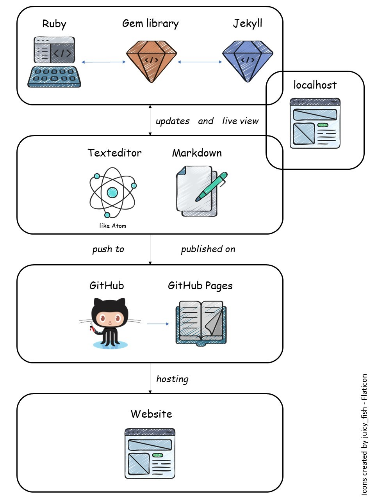

*What are Ruby, Jekyll and GitHub Pages?*
<!--more-->

<html>
<head>

</head>
</html>

## What is Ruby?
Known for its flexibility and support for multiple paradigms, Ruby is an interpreted, high-level, general-purpose programming language.  

Ruby uses <a href="https://en.wikipedia.org/wiki/Just-in-time_compilation" target="_blank">just-in-time compilation</a> in conjunction with dynamic typing and garbage collection. 

You can find more information about Ruby on <a href="https://www.ruby-lang.org" target="_blank">ruby-lang.org</a> and <a href="https://ruby-doc.org">ruby-doc.org</a>. 

### Gems

A Ruby package is called a <b>gem</b>. They act like libraries and can be stalled via the command line. Over 170,000 Ruby gems are hosted by <a href="https://rubygems.org" target="_blank">RubyGems.org</a>. Many new and existing Ruby libraries are also hosted on GitHub.

#### Jekyll
The static website generator Jekyll is a Ruby gem written in Ruby.  

A static site generator automates the process of coding <a href="https://en.wikipedia.org/wiki/HTML" target="_blank">HTML</a> pages and makes them ready for serving to users ahead of time using raw data and a set of templates.  
Static site generators let users easily create full-featured static link <a href="https://en.wikipedia.org/wiki/HTML" target="_blank">HTML</a> websites.
 
The command line program does not offer a <a href="https://en.wikipedia.org/wiki/WYSIWYG" target="_blank">WYSIWYG</a> interface, but you start Jekyll via the command line - e.g. via the terminal on Windows or Mac.
 
Jekyll builds static HTML web pages from simple text files that are read in. These are layout files and content files. Jekyll generates the static HTML web pages based on the layout templates. This even works live during development, because Jekyll comes with its own server, which you can start along with Jekyll.
 

        <figure>
            
            <figcaption>Ruby is programming language, which contains Gems like Jekyll.</figcaption>
        </figure>

 

## What is Markdown?

<a href="https://daringfireball.net/projects/markdown/" target="_blank">Markdown</a> lets users write using a simple plain text format and convert it to structurally valid HTML. It's an easy-to-use text-to-HTML tool for web writers.

Markdown can be written in every text editor like Notepad or even Word. One of the most used text editors is Atom.

### Atom
<a href="https://atom.io/" target="_blank">Atom</a> is a free and open-source text and source code editor for macOS, Linux, and Microsoft Windows with support for plug-ins written in JavaScript, and embedded Git Control. Atom's default packages can apply syntax highlighting for multiple programming languages and file formats.

Syntax highlighting is the ability of a computer program to display certain words and character combinations in a text in different colors, fonts and styles depending on their meaning. Syntax highlighting improves the readability of texts: structures in the text are easier to recognize, "cross-reading" is simplified, comments appear separated from the actual code and typos are noticed more quickly, since in many cases a typo leads to a changed display.

To come back to Jekyll renders <a href="https://daringfireball.net/projects/markdown/" target="_blank">Markdown</a> or textile templates and produces a complete static website that can be served via a web server.

Jekyll is the engine behind GitHub Pages.

        <figure>
            
            <figcaption>Atom can be used to write Markdown.</figcaption>
        </figure>

 

## What is Github Pages?
<a href="https://pages.github.com/" target="_blank">GitHub Pages</a> is a free static web hosting service offered by <a href="https://github.com/" target="_blank">GitHub.com</a> that allows users to create websites based on their GitHub repositories. It is for hosting user blogs, project documentation, or even whole books created as a page.
 
<ul>
<li><a href="https://r-lidar.github.io/lidRbook/" target="_blank">R LIDAR Book </a> by Jean-Romain Roussel et al.</li>
<li><a href="https://geocompr.robinlovelace.net/" target="_blank">Geocomputation with R </a> by Robin Lovelace et al.</li>
<li><a href="https://r-graphics.org/" target="_blank">R Graphics Cookbook, 2nd edition</a> by Winston Chang</li>
</ul>
 
For more R Markdown Books visit <a href="https://bookdown.org/" target="_blank">Bookdown.org</a>.

### What is Github?
GitHub, Inc. is a provider of Internet hosting for software development and version control using Git. The word GitHub is a combination of the terms Git and Hub. The term hub can be translated as "central location" or "central collection point" and means the server. The term Git, on the other hand, comes from the version management software of the same name.
  
Often many - even hundreds - of programmers work on a program or software project. Each is responsible for a different part of the program. Instead of sending all the changes to a central person who implements these individual pieces of program code into the finished final program, Git takes over this work automatically.
  
The great feature of this is that each change is saved and stored as a new version. Thus, it is always possible to fall back on one of the existing older versions in case of errors or occurring problems.
  
Further Information about Github see the <a href="https://geomoer.github.io/moer-base-r/unit99/sl02_github.html" target="_blank">Base R Course</a>.
  
All GitHub Pages content is stored in a Git repository, either as files served to visitors verbatim or in Markdown format. GitHub is seamlessly integrated with Jekyll static web site and blog generator and GitHub continuous integration pipelines. Each time the content source is updated, Jekyll regenerates the website and automatically serves it via GitHub Pages infrastructure. As with the rest of GitHub, it includes both free and paid tiers of service, instead of being supported by web advertising.

        <figure>
            
            <figcaption>GitHub hosts your content for GitHub pages.</figcaption>
        </figure>

## Summary
In summary, this means, in a text editor like Atom the content of the website is written in Markdown or HTML.
  
Then this content is automatically updated by Ruby using the Jekyll Gem, which gives also a local preview of the page. The condition is, of course, that Ruby is already running in the background.
  
When the content is ready for the audience, it will then be uploaded to GitHub, where it will be published or updated on GitHub Pages.
  
In the end, your carefully written content is public for everyone to find.

  

## Comments

You may leave comments below if you have questions or remarks about the content in this unit.

<!--
## Further reading

(https://commons.wikimedia.org/wiki/File:Ruby_logo.svg )

add some day
-->
