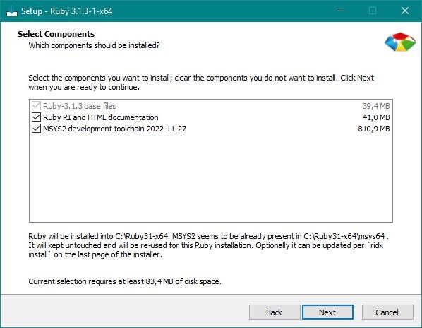
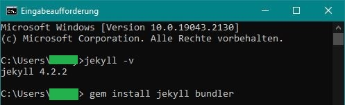
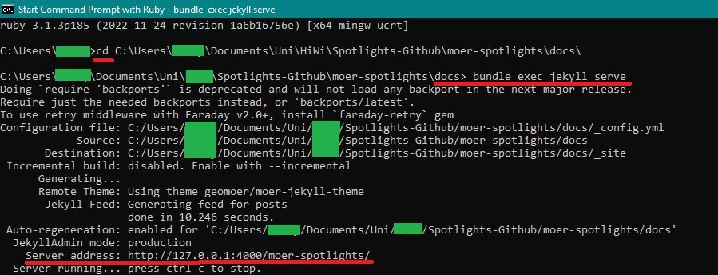
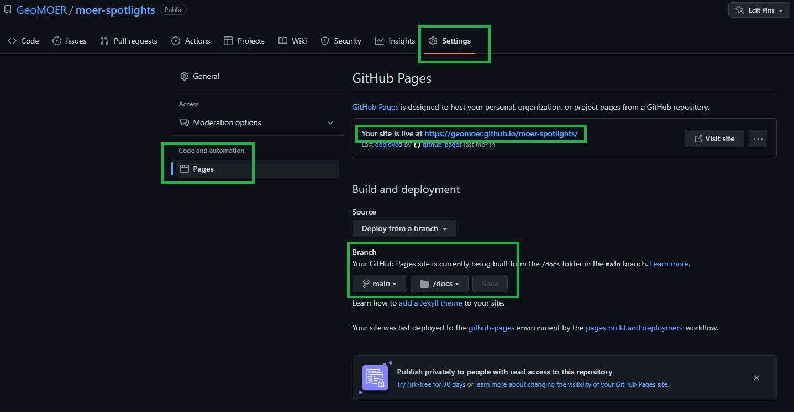
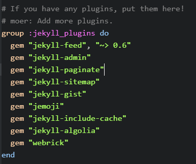

## Prerequisites

### Installing Ruby

1. Install the latest version of the rubygems with devkit 64 from [rubyinstaller.org](https://rubyinstaller.org/downloads/){:target="_blank"}.

2. Run the ridk install step on the last stage of the installation wizard. This is needed for installing gems with native extensions. You can find additional information regarding this in the RubyInstaller Documentation.
3. Accept the licenses
4. Choose a path and check both boxes: Add Ruby executables to your PATH and Associate .rb and .rbw files with this Ruby installation
6. From the options choose MSYS2 and MINGW development tool chain.
7. Open a new command prompt window (terminal) from the start menu, so that changes to the PATH environment variable becomes effective.
8. Install Jekyll and Bundler using ``gem install jekyll bundler``
9. Check if Jekyll has been installed properly with ``jekyll -v``
10. Restart the computer afterwards, just to make sure, especially if you are under Windows.

### Installing Gems
Install the bundler through the terminal: ``gem install bundler``. The path does not matter where you execute it.
Close and restart the terminal to update the PATH Variables (otherwise the gem function is not available).
If this does not work, restart the computer, especially if you are using Windows.

### Rechecking Prequisities
Check if you have all other prerequisites installed (if any), here: [jekyllrb.com](https://jekyllrb.com/docs/){:target="_blank"}.

--------------------------------------

## Starting a new Project

### GitHub
First create your new project on [Github.com](https://www.github.com){:target="_blank"} and clone it to your drive. For example **awsome_project**. Next step is creating the docs folder for your websites structure.

### Creating 'docs' Folder
You can either work in the windows terminal or using Rubys Terminal calling "Start Command Prompt with Ruby". The following instructions are all done with Rubys Command Prompt.

The ``docs`` folder is created through a terminal. Therefore all gems to generate your page will be installed properly.

First change the directory where your Github project is saved. You can do this by typing ``cd path_to_your_project``. cd stands for change directory.
``C:\...> cd C:\Users\me\github_projects\awsome_project``

Then you can initialize your new project. This is done by specifying ``jekyll new`` and a ``projectname`` after the path. In this case we call it "docs" because we want a docs folder.

``C:\Users\me\github_projects\awsome_project jekyll new docs``

Then you need to change the directory to your awsome_project docs folder:

``C:\Users\me\github_projects\awsome_project> cd C:\Users\me\github_projects\awsome_project\docs``

Finally you can execute the previously installed bundles and serve your (still empty) jekyll page via the command ``bundle exec jekyll serve``.

``C:\Users\me\github_projects\awsome_project\docs> bundle exec jekyll serve``

The gems will be installed in your local repository folder. If you want, and often you should want, exclude them from synchronizing with GitHub by adding the ``.bundle`` or ``vendor`` folders to your ``.gitignore`` file.

Congratulations! You created your first local page. Local means, that it is not online but locally hosted only via your server IP available.

### Local Live View
With local hosting, a live preview of the site before it is hosted on Github is possible. If you change and save files, the changes will directly be processed for updating the page. Do not forget to refresh the page in your browser for seeing the changes. This is visible in the following image on last block that starts with ``Regenerating``.

When you ran ``bundle exec jekyll serve`` and you received no errors you can open the page in a browser following the address given in the terminal. Look for something like ``Server address: http://127.0.0.1:4000/projectname/`` and copy this to the address bar of your browser. If this worked you can proceed with serving the page on GitHub.

---------------------------------------------------------------------

### Github again
1. Push your local changes to GitHub.
2. Use your browser and navigate to the settings of your GitHub repo and turn on "GitHub Pages" under "pages" on the left.
3. Therefore, select the master branch as source and /docs as folder.
4. The URL for your GitHub page can also be found there.
5. Note that pushed changed will take a while to be processed by GitHub and will not instantly be globally available unlike the local hosting. This might take 1 to 5 minutes.

---------------------------------------------------------------------

## Common errors

**Error:**

``C:/Ruby31-x64/lib/ruby/gems/3.1.0/gems/jekyll-admin-0.11.0/lib/jekyll-admin.rb:12:in `require': cannot load such file -- webrick (LoadError)``

**Solution:** Add gem "webrick" to gemfile.

For example: If you are using the GeoMOER theme, there are lines that look something like on the right. It lists all the gems that should be loaded. At this point you simply add ``gem "webrick"``.

--------------------------------------

**Error:**
An already created page is refreshed after some time and should be reloaded with ``bundle exec jekyll serve``. The command cannot be executed because some gem packages cannot be loaded or are no longer compatible.

**Solution:** Delete gemfile.lock and start ``bundle exec jekyll serve`` again. Now everything should be up to date. P.S. make sure Ruby is also updated.
